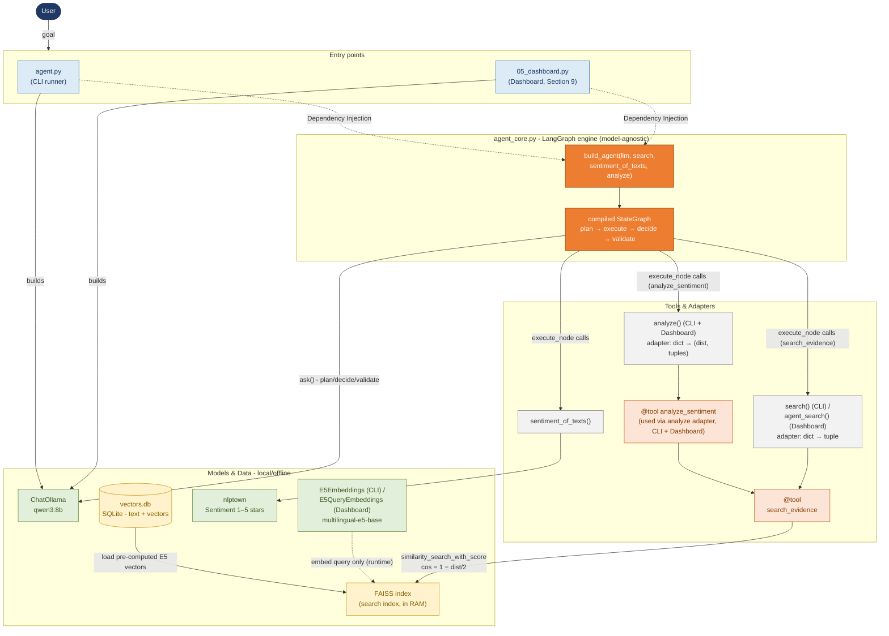
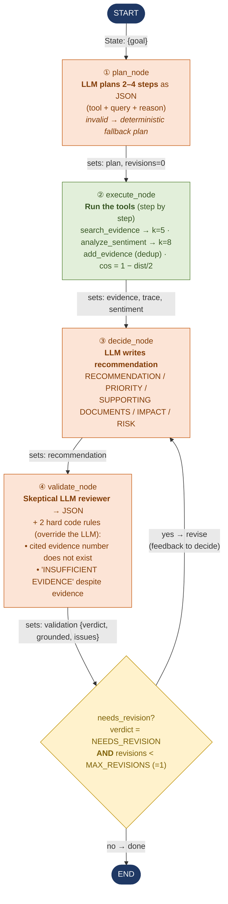

# Strategic Intelligence Agent - LangChain / LangGraph Variant

**A Strategic Intelligence Agent for Lufthansa** · NLP exam project (Step 2)
All components run **locally / offline** - no paid LLM APIs.

The agent monitors public sentiment from community posts, news articles and corporate
announcements, and delivers **risk/opportunity analyses** and **evidence-based recommendations**.
Unlike plain RAG, it autonomously runs the full workflow:

> **Goal → Plan → Retrieve → Analyze → Decide → Recommend → Validate**

---

## Table of contents
- [What makes this an agent (not just RAG)](#what-makes-this-an-agent-not-just-rag)
- [Business questions](#business-questions)
- [Architecture](#architecture)
- [Flow](#flow)
- [Files & components](#files--components)
- [How to run](#how-to-run)
- [Key concepts for the oral exam](#key-concepts-for-the-oral-exam)

---

## What makes this an agent (not just RAG)

The original project (steps 01–05) is a **RAG pipeline**. In the LangChain variant it is
expanded into a **fully-fledged agent** that goes through the workflow autonomously.
The new files are `agent_core.py` (the LangGraph engine) and `agent.py` (the CLI runner);
data collection, embedding (`multilingual-e5-base`) and sentiment analysis (`nlptown` BERT)
from steps 01–03 are **reused unchanged**.

| | Plain RAG | This agent |
|---|---|---|
| Who writes the search query? | the human | the **LLM** (derived from the goal) |
| Steps | one retrieval → answer | **plans 2–4 steps**, runs tools, decides, **validates**, self-corrects |
| Human input | a query | **only the goal**, then fully autonomous |

> The professor's distinction: plain RAG is **not** an agent. The agent quality here comes
> from the **planning**, **tool selection**, and the **self-validation / revision loop**.

---

## Business questions

| # | Question (EN) |
|---|---|
| 1 | What is currently the biggest risk for Lufthansa, and what evidence supports it? |
| 2 | Which strategic opportunity should Lufthansa prioritize next? |
| 3 | From today's perspective, which measures should be prioritised, and why? |
| 4 | Which competitor activities should Lufthansa monitor right now, and what evidence shows this? |
| 5 | Which technologies or industry trends should Lufthansa's management monitor, based on current reports? |

---

## Architecture

Building blocks and how they connect (not the temporal sequence - see [Flow](#flow)).



**Key ideas:** Dependency Injection (models/search passed in from outside → shared by CLI &
Dashboard, no double loading) · storage (SQLite) vs. search (FAISS) separation · the `search()`
adapter decouples the graph from FAISS/LangChain (dict → tuple) · offline-first.

> Retrieval note: similarity search no longer uses a NumPy scalar product over all vectors
> (brute force) but a **FAISS index**. Pre-computed E5 vectors are loaded from `vectors.db`
> (no re-embedding); only the query is embedded at runtime. Cosine is reconstructed from the
> L2 distance: **`cos = 1 − dist/2`** (valid because vectors have length 1).

---

## Flow

The temporal sequence through the LangGraph `StateGraph`.



> 🟧 **orange = LLM node** (stochastic) · 🟩 **green = pure code** (deterministic) · 🟨 **yellow = branch**

**Per node:**

| # | Node | Who? | Reads | Sets |
|---|------|------|-------|------|
| ① | `plan_node` | LLM | `goal` | `plan` (2–4 steps), `revisions=0` |
| ② | `execute_node` | Code | `plan` | `evidence`, `trace`, `sentiment` |
| ③ | `decide_node` | LLM | `evidence`, `sentiment`, optional feedback | `recommendation` |
| ④ | `validate_node` | LLM + code rules | `recommendation`, `evidence` | `validation` |
| ↺ | `needs_revision` | Code | `validation`, `revisions` | edge: `decide` **or** `END` |

In the normal case the graph runs **once** (validation `APPROVED`). The revision loop fires
**only** on an actual defect, and at most **once** (`MAX_REVISIONS = 1`).

---

## Files & components

| File | Role |
|---|---|
| `agent_core.py` | LangGraph engine: `build_agent(...)`, the four nodes, `needs_revision`, helper functions (`extract_json`, `add_evidence`, `evidence_block`, `cited_ids`, `clean_think`). **Model-agnostic.** |
| `agent.py` | CLI runner: builds `ChatOllama`, `E5Embeddings`, FAISS, the `@tool`s and the `search()` / `analyze()` adapters, then `agent.invoke({"goal": ...})`. |
| `05_dashboard.py` | Streamlit dashboard; **Section 9** runs the same agent interactively via `agent.stream(...)` and shows plan / evidence / recommendation / validation live. |
| `vectors.db` | SQLite store: text + pre-computed E5 vectors. |
| `evaluation_sentiment.ipynb` | Evaluates the nlptown sentiment model against a small labelled sample. |

> Naming note (Dashboard): in `05_dashboard.py` the identifier `search()` is the **NumPy/RAG**
> search used by Sections 3–8; the agent's FAISS adapter there is named **`agent_search()`**,
> and the embeddings class is **`E5QueryEmbeddings`**.

---

## Technology Stack

| Layer | Technology | Version |
|---|---|---|
| Reasoning LLM | qwen3:8b via Ollama (`langchain-ollama` ChatOllama) | ollama 0.6.2 · langchain-ollama 1.1.0 |
| Embeddings | `intfloat/multilingual-e5-base` (sentence-transformers) | 5.5.1 |
| Sentiment | `nlptown/bert-base-multilingual-uncased-sentiment` (transformers / torch) | 5.12.1 / 2.12.1 |
| Vector search | FAISS via `langchain-community` (+ `faiss-cpu`) | 0.4.2 / 1.14.3 |
| Knowledge store | SQLite (`vectors.db`) | Python stdlib |
| Agent framework | LangGraph `StateGraph` (`langgraph`) + LangChain core/tools | langgraph 1.2.6 · langchain-core 1.4.8 |
| Dashboard | Streamlit + Plotly | 1.58.0 / 6.8.0 |
| Data collection | feedparser (RSS) | 6.0.12 |
| Evaluation | scikit-learn + matplotlib | 1.9.0 / 3.11.0 |
| Numerics | NumPy | 2.4.6 |

_Versions match `requirements.txt` / the tested `.venv`. All components run locally/offline — no paid LLM API._

---

## Design Decisions

- **From-scratch RAG → agent:** steps 01–05 are a hand-built RAG pipeline; the LangChain variant adds an explicit agent layer (plan → execute → decide → validate) so the system demonstrates *agent* behaviour, not just LLM+RAG.
- **FAISS instead of ChromaDB:** the E5 vectors already live in SQLite (`vectors.db`); FAISS is a lightweight **in-memory index** on top — no second datastore, no server and keeps us close to the distance math (`cos = 1 − dist/2`). ChromaDB's persistence/metadata features aren't needed for a few thousand chunks.
- **multilingual-e5-base instead of bge/MiniLM:** the corpus is **German + English**; e5 is multilingual and uses `query:` / `passage:` prefixes. (The assignment lists bge/MiniLM only as *recommended*, not mandatory.)
- **Dependency Injection (`build_agent`):** the LLM, `search`, `sentiment_of_texts` and `analyze` are passed in from outside → `agent_core.py` stays **model-agnostic**, is shared by CLI and dashboard, and models are not loaded twice.
- **`temperature=0`:** reproducible runs (same goal → same plan/recommendation, as far as the model allows).
- **`MAX_REVISIONS = 1`:** exactly one self-correction pass, balances quality against latency on local hardware.
- **`MAX_STEPS = 4`, `k = 5` / `k = 8`:** thoroughness vs. prompt size and speed on a local 8B model.
- **Deterministic fallback plan:** if the LLM returns invalid JSON, a fixed 3-step plan keeps the demo always runnable.
- **Two hard validation rules override the LLM:** non-existent cited evidence numbers, and `INSUFFICIENT EVIDENCE` despite available evidence, both force a revision, a deterministic safety net around the stochastic reviewer.
- **No model finetuning:** all models are pretrained.

---

## How to run

**Prerequisites:** local [Ollama](https://ollama.com) with the model pulled, and the HF models
cached locally (E5 + nlptown). Run from the folder that contains `vectors.db`.

```bash
# 1. Start Ollama and pull the model
ollama serve
ollama pull qwen3:8b

# 2a. CLI run
python agent.py

# 2b. Dashboard (Section 9 = the agent)
streamlit run 05_dashboard.py
```

Both entry points use `ChatOllama(model="qwen3:8b", temperature=0)` for reproducible runs.

---

## Key concepts for the oral exam

- **One human input:** only the `goal`. From `agent.invoke({"goal": ...})` onward everything is autonomous.
- **The plan is not hard-coded:** the LLM derives the queries from the goal. Hard-coded queries exist **only** in the fallback plan (when the LLM returns invalid JSON).
- **`2–4 steps` is a prompt request, not a code rule:** the code enforces only *max 4* (`plan[:MAX_STEPS]`) and *min 1* (else fallback). Each step is a tool call `{tool, query}`.
- **Self-validation:** a skeptical LLM reviewer plus **two hard code rules** that override the LLM (non-existent cited evidence numbers; "INSUFFICIENT EVIDENCE" despite available evidence).
- **Deterministic vs. stochastic:** LLM nodes vary; the scaffold (code, hard rules, fallback, FAISS ranking) is deterministic. `temperature=0` greatly reduces LLM variance, but not bit-for-bit.
- **`<think>` handling:** `clean_think` / `THINK_RE` strip the reasoning tags of reasoning models (qwen3, DeepSeek-R1). With non-reasoning models they simply do nothing.
- **No model finetuning:** all models are pretrained; tuning happens via hyperparameters (`k`, `MAX_STEPS`, `MAX_REVISIONS`, `temperature`, …) and **prompt engineering**.


---

## Full report (DOKU-EN-FIN)

_The complete project report, converted from `DOKU-EN-FIN.pdf`.

### Project

| Title | AI CEO: Strategic Intelligence Agent |
| --- | --- |
| Course | Natural Language Processing |
| Company | Lufthansa |
| Author \| Student | Kay Müller \| 100006647 |
| EXAM-Submit Date | 22.06.2026 |

### A Strategic Intelligence Agent for Lufthansa

### The Orientation Agent monitors public sentiment based on community posts, news articles and corporate announcements. In addition to providing an overview of public sentiment, the Agent also delivers valuable risk and opportunity analyses, as well as evidence-based recommendations for decision-making.

### Choice of company

Given that my professional background had so far been heavily focused on the automotive sector, a company in the aviation industry was a welcome change. That is why, from the list provided, I chose Lufthansa, which has a fleet of 269 (plus 81 Orders) and has a very wide public reach, both nationally and internationally. The airline is therefore an excellent barometer of public sentiment for the agent.

### Business questions

- DE: „Was ist aktuell das größte Risiko für Lufthansa, und welche Belege stützen das?"
EN: „What is currently the biggest risk for Lufthansa, and what evidence supports it?"

- DE: „Welche strategische Chance sollte Lufthansa als Nächstes priorisieren?"
EN: „Which strategic opportunity should Lufthansa prioritize next?"

- DE: "Welche Maßnahmen sollten aus heutiger Sicht priorisiert werden und warum?"
EN: "From today’s perspective, which measures should be prioritised, and why?"

- DE: „Welche Aktivitäten der Wettbewerber sollte Lufthansa aktuell im Blick behalten und welche Belege zeigen das?"
EN: „Which competitor activities should Lufthansa monitor right now, and what evidence shows this?"

- DE: „Welche Technologien oder Branchentrends sollte das Lufthansa-Management beobachten – gestützt auf die aktuellen Meldungen?"
EN: „Which technologies or industry trends should Lufthansa's management monitor, based on the current reports?"

### Addition regarding the LangChain/LangGraph variant

The original project (steps 01–05) is a RAG pipeline. In the current LangChain version, it has been expanded into a fully-fledged agent that independently goes through the workflow

Objective → Planning → Research → Analysis → Decision-making → Recommendation → Review

autonomously. The files agent_core.py and agent.py have been added. The data collection, embedding (multilingual-e5-base) and sentiment analysis (nlptown-BERT) from steps 01–03 are reused unchanged.


### 1. Data collection (01_sources.py)

This script collects public posts (in real time) about Lufthansa from several independent RSS feeds, prioritising the longest available text, filtering out industry-specific feeds, removing duplicate URLs and saving everything as raw_data.json.

#### Overview

| Input data | Live-Feeds (URLs in LUFTHANSA_ONLY_FEEDS, GLOBAL_PRESS, COMPETITOR_FEEDS) |
| --- | --- |
| Output | raw_data.json  List of documents (Fields: source, title, text, date, url) |
| Dependencies | See Module imports; internet access |
| Requirements | Internet connection (live-retrieving the feeds) |
| Execution | python 01_sources.py |
| Side effects | Overwrites raw_data.json on every run |
| Key functions | strip_html(), select_best_text(), collect(source, url, pattern) |

#### There are four different sources, categorised by the origin of the information

- General news media (via Google/Bing aggregators)

- Community/public sentiment (Reddit)

- Financial/business news (Yahoo Finance)

- Aviation trade press (aeroTELEGRAPH/Aviation Week)

A further 8 competitors are covered via separate Google News searches. The corpus therefore reflects not only Lufthansa but also the competitive landscape.

#### Web scraping via BeautifulSoup approach rejected

I ruled out using BeautifulSoup for the company’s news channel. Unfortunately, it was not possible to access https://newsroom.lufthansagroup.com/en/ or https://www.lufthansagroup.com/en/newsroom/releases.html directly using BeautifulSoup, as the domain blocks all direct access with a 403 error. This behaviour is familiar from the Data Engineering course, which suggests that bot protection is in place.


#### Module imports

| feedparser | Reads XML-based feeds and converts them into Python objects |
| --- | --- |
| json | Saves the collected documents as a JSON file |
| re | Regular expressions for the keyword filter and for removing HTML tags |

#### Feeds

… in constant LUFTHANSA_ONLY_FEEDS

| ("Google News DE",  "https://news.google.com/rss/search?q=Lufthansa&hl=de&gl=DE&ceid=DE:de"), |
| --- |
|  |
| ("Bing News",  "https://www.bing.com/news/search?q=Lufthansa&format=rss"), |
|  |
| ("Reddit r/lufthansa",     "https://www.reddit.com/r/lufthansa/.rss"), |
|  |
| ("Yahoo Finance LHA.DE", "https://feeds.finance.yahoo.com/rss/2.0/headline?s=LHA.DE&region=DE&lang=de-DE"), |
|  |
| ("Yahoo Finance DLAKY", "https://feeds.finance.yahoo.com/rss/2.0/headline?s=DLAKY&region=US&lang=en-US"), |
|  |
| ("Google News (official)", "https://news.google.com/rss/search?q=Lufthansa+site:lufthansagroup.com&hl=en-US&gl=US&ceid=US:en"), |
| ￫ An alternative solution to the BeautifulSoup 403 problem. Returns titles only. |
|  |

… in constant GLOBAL_PRESS

| ("aeroTELEGRAPH",         "https://www.aerotelegraph.com/feed"), |
| --- |
|  |
| ("Aviation Week",         "https://aviationweek.com/rss.xml"), |
|  |

￫ The constants KEYWORDS and COMPETITOR_KEYWORDS are required by these two constants above as a filter – see  Keyword filter

… in constant COMPETITOR_FEEDS

| ("Google News DE - Ryanair", "https://news.google.com/rss/search?q=Ryanair&hl=de&gl=DE&ceid=DE:de"), |
| --- |
|  |
| ("Google News DE - Wizz Air", "https://news.google.com/rss/search?q=%22Wizz+Air%22&hl=de&gl=DE&ceid=DE:de"), |
|  |
| ("Google News DE - easyJet", "https://news.google.com/rss/search?q=easyJet&hl=de&gl=DE&ceid=DE:de"), |
|  |
| ("Google News DE - Air France-KLM", "https://news.google.com/rss/search?q=%22Air+France%22+KLM&hl=de&gl=DE&ceid=DE:de"), |
|  |
| ("Google News DE - British Airways/IAG", "https://news.google.com/rss/search?q=%22British+Airways%22+OR+IAG&hl=de&gl=DE&ceid=DE:de"), |
|  |
| ("Google News DE - Turkish Airlines", "https://news.google.com/rss/search?q=%22Turkish+Airlines%22&hl=de&gl=DE&ceid=DE:de"), |
|  |
| ("Google News EN - Emirates", "https://news.google.com/rss/search?q=%22Emirates+airline%22&hl=en-US&gl=US&ceid=US:en"), |
|  |
| ("Google News EN - Qatar Airways", "https://news.google.com/rss/search?q=%22Qatar+Airways%22&hl=en-US&gl=US&ceid=US:en"), |

#### Keyword filter (implemented as a pattern)

The KEYWORDS constant allows filtering by lufthansa \| swiss (is protected against misinterpretation, such as Swissair, Swisscom, etc., by the \bswiss\b.) \| austrian airlines \| brussels airlines \| Eurowings \| discover airlines \| lufthansa cargo \| lufthansa Technik \| ITA airways.

The constant COMPETITOR_KEYWORDS enables filtering by ryanair \| wizz ?air \| easyjet \|british airways \| \bIAG\b \| iberia \| air france \| \bKLM\b \| turkish airlines \| emirates \| qatar airways.

##### Exclusion of NER

Named Entity Recognition (NER). NER could recognise brand names as organisations (ORG) and resolve ambiguous terms based on context, such as ‘Emirates’ (airline, ORG). NER was deliberately not used here because the filter is only applied to the specialist aviation press, where the terms are unambiguous anyway. The actual risk of false positives is therefore low. NER cannot replace the keyword list either; it can only supplement it. It would still be necessary to assign the recognised organisations to the eight competitors. An additional, multilingual model such as spaCy is required for each document.

#### Preliminary cleaning

HTML tags are undesirable right from the start of the import process and can be removed immediately.

- Regex for HTML tags:		TAGS = re.compile(r"<[^>]+>")

- Removing spaces (margin):		TAGS.sub("", html or "").strip()

#### Guidance on decision-making

Important note for decision-making: The text used for embedding and sentiment analysis is not normalised; that is, no lowercasing, stop-word removal, stemming or lemmatisation is applied. Lowercasing is only used internally for duplicate comparison. The selected e5 embedding and sentiment models require complete and natural sentences containing full information, as this is already limited due to short feeds.

#### Select text length (content > summary)

The `select_best_text` function selects the longest text available. For websites based on WordPress (such as aeroTELEGRAPH), for example, the ‘content’ field often provides the full text. If no full text is available (i.e. shorter than ‘summary’) or there is no ‘content’ field, as is the case with Google, the ‘summary’ is used instead.

#### Collection features

The `docs` list collects the results (one dictionary per document). The `seen` set quickly checks for duplicates using a hash. The reusable function `collect` reads a feed using `feedparser.parse(url)` and appends its relevant entries (one dictionary each) to `docs`, provided that the conditions are met (keyword filter for the industry feeds, a valid link that has not yet been viewed).

Note on the user agent: I tried `feedparser.parse(url, agent="Mozilla/5.0")`, but Reddit rejected it with a 403 error. The default value (without a user-agent) was accepted.

#### Caching to a file (raw_data.json)

The json.dump function writes everything as JSON to raw_data.json. The ensure_ascii=False setting ensures that umlauts remain legible, whilst indent sets the indentation to two spaces for better readability when checking the code manually.

#### Alternative NLP techniques

String Similarity: Duplicate detection is already carried out based on an exact link, exact content and an (almost) identical title.

### 2. Cleaning, embedding, vector database (02_clean_emb_db.py)

This script constitutes the second step in the pipeline. It loads the collected data from raw_data.json, cleans up the titles and text, excludes documents that are too short as well as (exact or near) duplicates, and generates embeddings using the multilingual model multilingual-e5-base (German + English). It then stores the title, text, source, date, URL and the vector (as JSON text) for each document in an SQLite table.

#### Overview

| Input data | raw_data.json (from step 1) |
| --- | --- |
| Output | vectors.db (SQLite, Table docs: id, title, text, source, date, url, vector) |
| Requirements | Step 1 completed; raw_data.json present; e5 model cached locally |
| Execution | python 02_clean_emb_db.py |
| Side effects | DROP & CREATE the docs table. Existing contents of vectors.db will be replaced |
| Key functions | clean(); Deduplicate by seen / seen_titles; Minimum length (< 40 characters discarded); prefix “passage: “ |

#### Module imports

| json | Reads the collected documents from `raw_data.json` and saves the vectors as JSON text in the database (`json.dumps`) |
| --- | --- |
| re | Regular expressions for removing HTML tags, normalising spaces and generating the title key for duplicate detection |
| sqlite3 | Creates the database `vectors.db` and stores the title, text, source, date, URL and vector for each document |
| SentenceTransformer | Loads the embedding model and converts text into 768-dimensional vectors |

#### Load raw data

Using `json.load(open("raw_data.json", encoding="utf-8"))`, the data collected in step 1 is loaded as a list of dictionaries.

#### Cleaning

| Schritt | Schritt | Code | Zweck |
| --- | --- | --- | --- |
| 1 | Remove HTML tags | re.sub(r"<[^>]+>", " ", text) | Remove markup such as <a> and <p> |
|  | Note: This is deliberately redundant with respect to Step 1. This step is a standalone pipeline stage. | Note: This is deliberately redundant with respect to Step 1. This step is a standalone pipeline stage. | Note: This is deliberately redundant with respect to Step 1. This step is a standalone pipeline stage. |
| 2 | Normalise whitespace | re.sub(r"\s+", " ", text) | Multiple spaces/tabs/line breaks as a single space |
| 3 | Trim leading spaces | text.strip() | Clean at the start/end |
| 4 | Merge title and text | content = (titel + " " + text).strip() | Common syllabus for the upcoming exams |
| 5 | Discard those that are too short or empty | if len(content) < 40: continue | Remove entries that are meaningless |
| 6 | Remove exact duplicates | if content.lower() in seen: continue | Identical content (even under a different URL) only once; .lower() = case-insensitive |
| 7 | Remove near-duplicates | titel_key = re.sub(r"\W+", " ", titel.lower()).strip()[:70] .if titel_key in seen_titles: continue | Same headline with a slightly different title (aggregator overlap between Google and Bing) |

#### Embedding via encoder: multilingual-e5-base

The multilingual-e5-base embedding model (multilingual, local) is best suited to this project. SentenceTransformer (“intfloat/multilingual-e5-base”) loads the multilingual sentence embedding model (768 dimensions), which supports German and English, in line with the mixed data. Furthermore, it understands semantics and synonyms, is multilingual in a local/offline setting, and offers a size-to-quality balance that is acceptable to me.

| Alternative | Rejected on the grounds that: |
| --- | --- |
| multilingual-e5-large | Better quality than the base version, but significantly slower and requires more RAM and storage |
| BAAI bge-base-en-v1.5 (Aufgaben-Empfehlung) | English only |
| BAAI bge-small-en-v1.5 | English only |
| all-MiniLM-L6-v2 | Primarily English, hence limited multilingualism (only 384 dimensions) |
| OpenAI text-embedding-3 | paid API and not local/offline |
| TF-IDF / CountVectorizer (BoW) | No transfer of meaning or language, and simply separates DE and EN into language silos (lexically) – even with n-grams |
| BM25 | Better than TF-IDF, but no semantics, synonyms or multilingual support (DE/EN) |
| Word2Vec / FastText (gemittelt) | Average, i.e. sentence meaning is only approximate and less precise than that of the Sentence Transformer |
| GloVe | pre-trained vectors (English) |

##### Prefix "passage: " (List Comprehension)

Creates a new list in a single line by prefixing each piece of document content with "passage: ". The multilingual-e5-base model expects this prefix for documents to be indexed. It signals the role of the text to the model, thereby improving the quality of the search results. The search query is subsequently prefixed with "query: " in the same way. Without the prefix, the relationship in the vector space becomes weaker, as the role of the text is lost.

##### Vector transformation with normalize_embeddings

All texts are converted into vectors. Here, `normalize_embeddings=True` normalises each vector to length 1. The resulting scalar product then corresponds to the cosine similarity. Performing L2 normalisation manually would simply mean more code, which is already handled directly by this flag.

#### Storing in SQLite

SQLite is built into Python, requires no server, and consists of just a single file, vectors.db.


| Alternative | Rejected on the grounds that: |
| --- | --- |
| FAISS | Fewer vectors and less transparent, UPDATE: Established in the agent variant |
| ChromaDB | Extra dependency; ChromaDB handles the actual calculation (cosine and distance calculations are performed internally) |
| PostgreSQL + pgvector | Complex server setup |

#### Alternative NLP techniques

Information Extraction

Extracting meaningful content (entities, relations) is no longer relevant to the project, as the regex keyword list already fully covers the filtering of relevant entities (Lufthansa, competitors). See also Exclusion of NER. This also helps to prevent potential problems arising from multilingualism.

POS-Tagging

With the e5 embedding approach, POS is not required because the Transformer processes grammar and context internally. Furthermore, NER was not used, where POS could have served as a pre-processing step.

Pre-processing and normalisation

Normalisation (stemming/lemmatisation) and stop-word removal improve traditional term matching, but are unnecessary for e5 and, moreover, counterproductive, as e5 expects the raw original text.

### 3. RAG (03_rag.py)

This script now represents the third step in the pipeline. It loads documents and vectors from vectors.db and answers a question using semantic similarity search

Query → Vector → Cosine against all document vectors → Top-k

and also determines the sentiment of each document (1–5 stars → negative/neutral/positive).

#### Overview

| Input data | vectors.db (from step 2); problem statement in the code |
| --- | --- |
| Output | Console output: Top k hits and sentiment distribution |
| Requirements | Step 2 completed (vectors.db); it needs the same e5 model as for the embedding; prefix ‘query: ’ used in the search |
| Execution | python 03_rag.py |
| Side effects | Read-only (no writing) |
| Key functions | search(question, k=5) |

#### Module imports

| json | Reads the vectors, which are stored as JSON text, back into Python lists |
| --- | --- |
| sqlite3 | Opens the vectors.db database and reads the stored documents |
| collections | Provides the counter that counts the sentiment labels (positive/neutral/negative) |
| numpy (np) | Calculates the cosine similarity between query and document vectors and ranks the results |
| SentenceTransformer | Loads the embedding model and converts text into 768-dimensional vectors |
| pipeline | Loads the sentiment model and assigns a sentiment label (1–5 stars) to each text |

#### Load vectors

sqlite3.connect("vectors.db") opens the database populated in step 02 and retrieves all rows as a list of tuples (title, text, source, date, url, vector). In doing so, `np.array([json.loads(z[5]) for z in lines])` converts the vector, which is stored as JSON text, back into numbers and constructs a 2D matrix (documents × 768).

#### Embedding the search

It is essential to use the same model (multilingual-e5-base) for the search as was used when creating the vectors, so that the queries can be compared with the document vectors.

#### Semantic search

The `search` function takes a question as input and returns the k most similar documents (k=5 by default).

`model.encode("query: " + question, normalize_embeddings=True)` converts the question into a normalised vector. ‘query: ’ is the e5 convention for questions (analogous to ‘passage: ’).

#### Similarity

Compute the dot product of the query with each document vector. As all vectors have a length of 1, the dot product is the cosine similarity. See also: Addition regarding the LangChain/LangGraph variant

#### Sentiment analysis via encoder: multilinguales BERT (uncased)

Integrated via the Hugging Face pipeline, it automatically truncates tokens to a maximum of 512 tokens (max_length=512 – the BERT limit; i.e. texts with more than 512 tokens are truncated).

Output: 1–5 stars. The label() function (lines 63–74) maps this to three classes:

-    1–2 stars         → negative

-    3 stars         	→ neutral

-    4–5 stars         → positive

A sentiment snapshot is calculated across all texts using collections.Counter (aggregation).

| Alternative | Rejected on the grounds that: |
| --- | --- |
| DistilBERT-SST-2 | English only, and just two categories (positive/negative) |
| VADER | English only/social media and word-for-word only |
| german-sentiment-bert | German only |
| Sentiment per LLM / eigenes Fine-Tuning | Slow and high training workload |

#### Evaluation of sentiment classification

To validate the sentiment step, a small, manually labelled sample of 13 short German/English texts (5 negative, 4 neutral, 4 positive) was classified using exactly the same pipeline as that used in 03_rag. py, and the results were compared with the labels using scikit-learn (classification_report, confusion_matrix). The notebook is called evaluation_sentiment.ipynb. The results for this sample are as follows:

| Class | Precision | Recall | F1-score |
| --- | --- | --- | --- |
| negative | 1.000 | 1.000 | 1.000 |
| neutral | 1.000 | 0.750 | 0.857 |
| positive | 0.800 | 1.000 | 0.889 |
| Accuracy |  |  | 0.923 |


#### Alternative NLP techniques

Bag of Words & N-Grams

A classic feature set and a precursor to TF-IDF. N-grams could also support trend detection (frequent bigrams such as ‘sustainable fuel’ as a trend signal). However, this technique provides neither semantics nor synonyms. e5, on the other hand, places them within the same semantic space.

TF-IDF (for the query)

A fully-fledged, traditional alternative to e5 vector search (TF-IDF matrix + cosine instead of embeddings). Explainable and requires no model download. However, it does not recognise synonyms or mixed languages (German and English). That is precisely why e5 was chosen.

Ranked Retrieval

Ranked retrieval (sorting by score, Top-k) has been implemented in the project as semantic retrieval using e5-Cosine. The traditional approach (using TF-IDF scores instead of embeddings) was not used because it does not support synonyms or a mix of German and English.

MLP sentiment classifier

An MLP head on the existing 768-dimensional e5 vectors would be the most obvious DIY alternative to multilingual BERT (uncased). However, this is not feasible due to a lack of labelled training data.

RNN / LSTM / GRU

Sequence classifiers, which read the text word by word, require training, labels and word embeddings, and are clearly inferior to the pre-trained Transformer (which uses self-attention rather than recursion). Recurrent networks are only worthwhile if their sequence memory provides a genuine advantage.

Fine-tuning a sentiment encoder

Retraining an encoder (BERT/RoBERTa/DistilBERT) on manually labelled Lufthansa/News data for true 3-class sentiment is a neat solution to the weakness in neutral sentiment identified in the evaluation. However, this requires a labelled training set. This is labour-intensive and the reason why it could not be implemented in the project (due to individual work and time constraints) but can only be identified as the correct alternative.

Model comparison analogous to Lab Hands-on 4

Accuracy (RoBERTa), speed/scale (DistilBERT, ~97% of BERT’s performance) and the correct architecture (encoder for classification, not the GPT-2 generator). At a conceptual level, this explains the choice of models: encoders are deliberately used for embedding (e5) and sentiment analysis (nlptown), because comprehension and classification tasks are better solved with bidirectional context than with a decoder.

#### Addition regarding the LangChain/LangGraph variant

In the agent variant, the similarity search is no longer calculated using a NumPy scalar product across all vectors (via brute force), but via a FAISS index. The pre-computed e5 vectors from vectors.db are simply loaded into the index (no re-embedding of the documents). Only the search query is embedded at runtime via the E5Embeddings class. The cosine is reconstructed from the L2 distance provided by FAISS (cos = 1 − dist/2, as the vectors have a length of 1).

### 4. LLM (04_llm.py)

In step 4 of the pipeline, a semantic search is performed on the `vectors.db` database to retrieve the k best records relating to a strategic question, which in this context primarily represent business questions. The search logic is the same as the previous one from 3. RAG (03_rag.py), but with the addition that entries containing fewer than 80 characters are filtered out. This usually applies to entries without body text (essentially ‘title-only’). These k best results are passed to the LLM in a prompt, sorted in descending order and accompanied by source references. To prevent hallucinations, the LLM is instructed to adhere strictly to the supporting evidence. This is followed by a local call to Qwen3:8b via Ollama. The LLM returns recommendations (RECOMMENDATION / SUPPORTING DOCUMENTS / EXPECTED IMPACT / RISK).

#### Overview

| Input data | vectors.db (from step 2); problem statement in the code |
| --- | --- |
| Output | Console output: LLM recommendation and list of documents used |
| Dependencies | Local Ollama service using the qwen3:8b model |
| Requirements | Step 2 completed; Ollama is running (local); offline flags set before the imports |
| Execution | python 04_llm.py |
| Side effects | None, read-only plus a local LLM call |
| Key functions | search(question, k=5); Konstante MIN_EVIDENCE_LENGTH (Title-only-Filter) |

#### Module imports

| os | Set the offline environment variables (HF_HUB_OFFLINE, TRANSFORMERS_OFFLINE) so that the model demonstrates local functionality |
| --- | --- |
| json | Reads the vectors stored in the database as JSON text back into Python lists (json.loads) |
| sqlite3 | Opens vectors.db and reads the documents (title, text, source, URL, vector) using SQL |
| numpy (np) | Converts the vectors into an array and calculates the cosine similarity (np.dot) for semantic search |
| SentenceTransformer | Loads the e5 embedding model and encodes the question into a 768-dimensional vector (model.encode) |
| ollama | Calls the qwen3:8b language model locally (ollama.chat) and generates the grounded recommendation |

#### Model information qwen3:8b

Ollama acts as the technical runtime environment for the qwen3:8b decoder, whilst qwen3:8b is the actual AI model.

Qwen3 is the latest generation of large language models in Qwen series, offering a comprehensive suite of dense and mixture-of-experts (MoE) models.


#### Offline validation

By using `import os`, `os.environ["HF_HUB_OFFLINE"] = "1"` and `os.environ["TRANSFORMERS_OFFLINE"] = "1"`, the offline status is simulated and the version query is suppressed.

#### Review of business questions

- Was ist aktuell das größte Risiko für Lufthansa, und welche Belege stützen das?

RECOMMENDATION: INSUFFICIENT EVIDENCE

SUPPORTING DOCUMENTS:

EXPECTED IMPACT:

RISK:

Evidence

Evidence 1: Unfall bei der Lufthansa: Ein riskanter Vorfall – für das Image der Lufthansa - WirtschaftsWoche (Google News DE - https://news.google.com/rss/articles/CBMi0gFBVV95cUxNRl9sTERHeUR1a2ZzeXF4VC1NY3ZaUVFpeXhPOHRuNFZaemlZS3puVW5ldlBKdjV6NWhCQ0RUUGtXX291UkRKWXpwbFpYYzh3RTJwVFRQeHJGZnhqNVJkeHFGaW9yODBSLUdDYTNzanBYck1aMEdIa3dUaExoVk9jTmtEUlNBalZTNnpxcUw3RVJEdTF2dVM3dVl3X0drcTJ4ejFKZkpwM3pkR0ZsRTFZY3B5TDR5aGhiUXJGZ211dXZFNkJKa29NaENCYVd2OU1yYnc?oc=5)

Evidence 2: Aktuelle Auswertung der besten Airlines: Lufthansa rutscht deutlich ab - WEB.DE (Google News DE - https://news.google.com/rss/articles/CBMinAFBVV95cUxNZ0NLem9pYm84Yks4ZEt0N0YyNHJTNmdGekVfOUNIMTVIdFI2cEZtaE1INlEtbWZDd0FoQ0ZPRTcwbmo3YkJwdU5tX2ZESmxVZ0tVV1NlczI1QU55UlZTWUs1ZnNJNzROZmNwMktITlYySVJ5SzRfY2puOHVUYkxZS2Y5d1ZWTUFpbHNtbzRDbjJadFdHSEJvWloxNUg?oc=5)

Evidence 3: Lufthansa: Stark! So sollten Anleger jetzt handeln (Bing News - http://www.bing.com/news/apiclick.aspx?ref=FexRss&aid=&tid=6a36659913b44126a0b7424b15c73436&url=https%3a%2f%2fwww.deraktionaer.de%2fartikel%2faktien%2flufthansa-stark-so-sollten-anleger-jetzt-handeln-20402864.html&c=10661014780193233683&mkt=de-de)

Evidence 4: Strategischer Vorteil für die Lufthansa: Verlorener Streik belastet Gewerkschaften - Tagesspiegel (Google News DE - https://news.google.com/rss/articles/CBMizwFBVV95cUxPR3c5RVRULWUxUmpBZXpMdHdJeENEYzJMZkkzeTBCblJqd3dycUttSjhpcy1OSWc0R1dJalRONjNZMlhnNkhlaVNHNERyS0lSYjFxYzZ1d1JOVExJeTF1a3NzWHhlVW1oSUFvdFBqdjlPTWZEeVB2NWVBald4YloyaTNvVEFkUmVWRVF4ZjVjbW91Wjlzb3JGWHQ0T0Q1UnhFbW5kcFVab3R5MGFEalNrYUZiX1ZBWHlQaDJqYjhVaTloRmtiR3ZDM1Zvb1VRVXc?oc=5)

Evidence 5: Energiekrise: Treibstoff für Lufthansa-Flüge im Sommer gesichert - DIE ZEIT (Google News DE - https://news.google.com/rss/articles/CBMimgFBVV95cUxQS2VGUk94RnZuU0ZQbnFrVHBWNjlwbld3S0VycEFnZV9XZGZnTXpDS0xLRmh1Y0ZkbEhuNEdMNEUzM2lhYUY3THNyeDc0OXMzbWdKWmFWWGl6TTByVUxkTzFZZUNESW5tLWlsRFQzZld0QlIwSTMxVGM0eWJUWXVxTDdpMTIyQjB3UkZ5Vml4ZG1aNWRHOGpJaF9B?oc=5)

- What is currently the biggest risk for Lufthansa, and what evidence supports it?

RECOMMENDATION: INSUFFICIENT EVIDENCE

SUPPORTING DOCUMENTS:

EXPECTED IMPACT:

RISK:

Evidence

Evidence 1: Reimbursement was not correctly handled, with the help of SÖP (Reddit r/lufthansa - https://www.reddit.com/r/Lufthansa/comments/1u8brvi/reimbursement_was_not_correctly_handled_with_the/)

Evidence 2: Lufthansa Ups ITA Stake As Kühne Influence Grows On Turnaround Path (Yahoo Finance DLAKY - https://finance.yahoo.com/news/lufthansa-ups-ita-stake-k-151624863.html?.tsrc=rss)

Evidence 3: Please read before posting (Reddit r/lufthansa - https://www.reddit.com/r/Lufthansa/comments/1dvv8g6/please_read_before_posting/)

Evidence 4: Assessing Deutsche Lufthansa (XTRA:LHA) Valuation After The New Supervisory Board Chair Appointment (Yahoo Finance DLAKY - https://finance.yahoo.com/markets/stocks/articles/assessing-deutsche-lufthansa-xtra-lha-150908340.html?.tsrc=rss)

Evidence 5: Lufthansa (XTRA:LHA) Stock Valuation Looks Balanced After Recent Gains (Yahoo Finance DLAKY - https://finance.yahoo.com/markets/stocks/articles/lufthansa-xtra-lha-stock-valuation-231428046.html?.tsrc=rss)

- Welche strategische Chance sollte Lufthansa als Nächstes priorisieren?

RECOMMENDATION: Prioritize the strategic partnership or merger with Air India to expand European and Indian market presence

SUPPORTING DOCUMENTS: 3

EXPECTED IMPACT: Enhanced revenue through Air India's growth in Europe, strengthened market share in key regions, and diversified route network

RISK: Operational integration challenges, potential regulatory hurdles, and competition from other airlines in target markets

Evidence

Evidence 1: INDEX-MONITOR: Hochtief vor Dax-Aufnahme - Lufthansa zweiter Kandidat (Yahoo Finance LHA.DE - https://de.finance.yahoo.com/nachrichten/index-monitor-hochtief-dax-aufnahme-125956783.html?.tsrc=rss)

Evidence 2: Strategischer Vorteil für die Lufthansa: Verlorener Streik belastet Gewerkschaften - Tagesspiegel (Google News DE - https://news.google.com/rss/articles/CBMizwFBVV95cUxPR3c5RVRULWUxUmpBZXpMdHdJeENEYzJMZkkzeTBCblJqd3dycUttSjhpcy1OSWc0R1dJalRONjNZMlhnNkhlaVNHNERyS0lSYjFxYzZ1d1JOVExJeTF1a3NzWHhlVW1oSUFvdFBqdjlPTWZEeVB2NWVBald4YloyaTNvVEFkUmVWRVF4ZjVjbW91Wjlzb3JGWHQ0T0Q1UnhFbW5kcFVab3R5MGFEalNrYUZiX1ZBWHlQaDJqYjhVaTloRmtiR3ZDM1Zvb1VRVXc?oc=5)

Evidence 3: Air India verlagert Wachstum nach Europa – Lufthansa-Deal soll bald greifen - Airliners.de (Google News DE - https://news.google.com/rss/articles/CBMikwFBVV95cUxPY2hPSmZ4VEdwMXpwUUZ1aURjdFYtR1pDUGY4U0xQVV9IaFZ6NjBqYUtKbFpBWnJZUi1KYnhaNkh6aEN1engtd2YxWXg3bVJHWEN4bWlSN0VlNGdFVy11dUtUamJoN2pLU0I5eFRzaW9NOWZUNG5xNndGS3dtLVN4U2pXSE1lWjFSR25TV0JsbmZNczg?oc=5)

Evidence 4: Schon im Herbst kann der neue Investor bei Tap mitreden (aeroTELEGRAPH - https://www.aerotelegraph.com/airlines/lufthansa-group-vs-air-france-klm-schon-im-herbst-kann-der-neue-investor-bei-tap/0t2yfw7)

Evidence 5: Unfall bei der Lufthansa: Ein riskanter Vorfall – für das Image der Lufthansa - WirtschaftsWoche (Google News DE - https://news.google.com/rss/articles/CBMi0gFBVV95cUxNRl9sTERHeUR1a2ZzeXF4VC1NY3ZaUVFpeXhPOHRuNFZaemlZS3puVW5ldlBKdjV6NWhCQ0RUUGtXX291UkRKWXpwbFpYYzh3RTJwVFRQeHJGZnhqNVJkeHFGaW9yODBSLUdDYTNzanBYck1aMEdIa3dUaExoVk9jTmtEUlNBalZTNnpxcUw3RVJEdTF2dVM3dVl3X0drcTJ4ejFKZkpwM3pkR0ZsRTFZY3B5TDR5aGhiUXJGZ211dXZFNkJKa29NaENCYVd2OU1yYnc?oc=5)

- Which strategic opportunity should Lufthansa prioritize next?

RECOMMENDATION: Expand stake in ITA Airways

SUPPORTING DOCUMENTS: 3

EXPECTED IMPACT: Strengthening market presence in Italy, potential cost synergies, and enhanced regional connectivity.

RISK: Operational risk from integrating ITA Airways, financial risk from increased capital investment.

Evidence

Evidence 1: Assessing Deutsche Lufthansa (XTRA:LHA) Valuation After The New Supervisory Board Chair Appointment (Yahoo Finance DLAKY - https://finance.yahoo.com/markets/stocks/articles/assessing-deutsche-lufthansa-xtra-lha-150908340.html?.tsrc=rss)

Evidence 2: Lufthansa Group Accelerates Strategy Implementation - Lufthansa Group Newsroom (Google News (official) - https://news.google.com/rss/articles/CBMilgFBVV95cUxOR05Zb1lpMDh3TlhnOWJqaUZSby1kQ1VrT3RGN01KczJibzA0TkFKQkxCUkFXejFNckZHX3lkRGxCNENXOHlUU2JwM3NPTjVma3U2RERtVl84Y1VMWEhIZzItdzRGTjlCWlprQ1pWeVRyU204Rm1Uc28zZWk3NFo2WWhrZFhqdXozUE9xVzlIalRpUk84WEE?oc=5)

Evidence 3: Lufthansa Ups ITA Stake As Kühne Influence Grows On Turnaround Path (Yahoo Finance DLAKY - https://finance.yahoo.com/news/lufthansa-ups-ita-stake-k-151624863.html?.tsrc=rss)

Evidence 4: Lufthansa (XTRA:LHA) Stock Valuation Looks Balanced After Recent Gains (Yahoo Finance DLAKY - https://finance.yahoo.com/markets/stocks/articles/lufthansa-xtra-lha-stock-valuation-231428046.html?.tsrc=rss)

Evidence 5: Deutsche Lufthansa AG: Release according to Article 40 (1) of the WpHG (the German Securities Trading Act) with the objective of Europe-wide distribution (Yahoo Finance DLAKY - https://finance.yahoo.com/markets/stocks/articles/deutsche-lufthansa-ag-release-according-114100902.html?.tsrc=rss)

- Welche Maßnahmen sollten aus heutiger Sicht priorisiert werden und warum?

RECOMMENDATION: Implement customer-centric service enhancements such as expanded legroom and priority boarding

SUPPORTING DOCUMENTS: 3

EXPECTED IMPACT: Improved passenger satisfaction and loyalty, potentially increasing market share and revenue through competitive differentiation

RISK: Operational costs for redesigning seating and boarding processes, and risk of competitors adopting similar measures

Evidence

Evidence 1: Chef von Air France-KLM sagt, weshalb der soziale Frieden so wichtig ist - aeroTELEGRAPH (Google News DE - Air France-KLM - https://news.google.com/rss/articles/CBMiyAFBVV95cUxNMUFkbTdjSXRQTVlxUWFON3VqSl9Ya3o1RDQzektsZm9SX3Z3SDBzcDk3SEdOSUJ5aXFRYXVvUzI1UTRXNUFiNk45MHFUVDY5UFZHRVdsaVRqcE9lTnJZOWN3OEVyTGNxanNZekcwWmI5YXpZbG5Hb1BPQ0IzNWdmWXBIcjFINlFzRi1TNFNkQW9mcG1TV1hEZDdPQVgyd3kwZWZJdWZ6RFFfRFpHUXJfR2JfbksyMUxYRmdzWXU4ZmR6cjRNOHc2cg?oc=5)

Evidence 2: Destination LEJ: Eine andere Flughafenpolitik muss möglich sein - Leipziger Zeitung (Google News DE - Turkish Airlines - https://news.google.com/rss/articles/CBMiswFBVV95cUxNeUVYbzc0THZ1cEJKMjA2Qm9EbXJkT191YTBiR0NsQklsb1RfU0RBSXdBbHc1MkhQNWhtVHZyaFBsaE5vbHhDbUZ0LUR5TDh5Ny15VDRNRDloVFFndDdNUGp6MzV6bk5tX0JqMkREUGttbDdzWXVXcWlaYnRfSjZlSlFKZEJ2ME9ldThuWVdvaUJ5c2xYWDVycUNPanExLVJTSnJWYXlDdGNzY29iNFJVMnNUaw?oc=5)

Evidence 3: Mehr Beinfreiheit und Priority-Boarding, wie der EasyJet Up Front Seat das Fliegen verändert - AD HOC NEWS (Google News DE - easyJet - https://news.google.com/rss/articles/CBMizAFBVV95cUxNbG9Bb1lyNDJTY1k3ckRfRnZyLXF3T1lsLTJZSkJybDlyem9qVnNZNzF6a1lQbEFHZTM4anJrVE5FOWRycGVmR1VpbTRxTVVueU5NN01HOGJpZUpwTzhBczU0YnJXd3hxUmVva1AwNGwxcUZqbnE4eFF3U2U5S1Frbk42WWxialpYdFhKdDIyRkN0SE12RC1TSHdIVnZsX2RsTkJraW01bW9nbnVFTWd0ZlFxT2RhNG5jekItWWRSYmZQV1RJNm9Sb3dYa0I?oc=5)

Evidence 4: "Turkish Airlines soll die erste Wahl für Reisende weltweit werden" - Airliners.de (Google News DE - Turkish Airlines - https://news.google.com/rss/articles/CBMihwFBVV95cUxOVWQtaEoxTkN1UDJiV193MjZQRHJnOGpEdkIwNW1JM1lSeTJpRVo1YlNoblNfUDNSeGU5SnRtVlA1bENXbVEtSGRFMmZJWjdiblRlMzFFTDk2QXhMTHN0Y2YxWXkxWTk5RmFzQ3N2dTlkMjE0TjdTYVFybUVMWkYxMDU0OVkxMUU?oc=5)

Evidence 5: IAG vor neuem Analystenfokus: Was die Bewertung und der Kurs jetzt bedeuten - AD HOC NEWS (Google News DE - British Airways/IAG - https://news.google.com/rss/articles/CBMiwgFBVV95cUxPV29WMlZBaDdwXzdxZTFOU21aN2dhM2t3T3BVeEprTmlBMW91ZzVKczVvUnhkdzZlWVpzT3BlbDF5YnZCYVBZTzd0Sk5zN25tRnJNdEp3VUJ1TWNHOHp0eG8yMDc5NEJLQjVUOHB3M3FfWGVUQ2dKZjRNZUNubElTVzVoMkxXZmVMTjh4cDdGNm93X0M4OVE3SGVFQ0l2bW9YaUFQM01NQ3JrNUhCMmtDYV9TZ2xwMDI5YktSaWFfX05ldw?oc=5)

- From today’s perspective, which measures should be prioritised, and why?

RECOMMENDATION: INSUFFICIENT EVIDENCE

SUPPORTING DOCUMENTS: 1, 2, 3, 4, 5

EXPECTED IMPACT: N/A

RISK: N/A

Evidence

Evidence 1: Reimbursement was not correctly handled, with the help of SÖP (Reddit r/lufthansa - https://www.reddit.com/r/Lufthansa/comments/1u8brvi/reimbursement_was_not_correctly_handled_with_the/)

Evidence 2: Kudos (Reddit r/lufthansa - https://www.reddit.com/r/Lufthansa/comments/1u6zmoi/kudos/)

Evidence 3: Prepare for turbulence - how a prolonged Middle East conflict could reshape how we fly - BBC (Google News EN - Emirates - https://news.google.com/rss/articles/CBMiWkFVX3lxTE4xTDllWkNWQlR2RjlyQmFxZUFwVjdyTFd0Vm8zd2lOSzRWdktZNU13VkR1bVZrUW1CN1M1aE5XNWpzYndqajVtWC1TUHk3TzNNaVVSRU1OYjVpdw?oc=5)

Evidence 4: Layover time FRA 2hrs (LAX-FRA-CPH) (Reddit r/lufthansa - https://www.reddit.com/r/Lufthansa/comments/1u8pw40/layover_time_fra_2hrs_laxfracph/)

Evidence 5: Unfamiliar with Frankfurt airport and looking for lounge advice (Reddit r/lufthansa - https://www.reddit.com/r/Lufthansa/comments/1u8cmo6/unfamiliar_with_frankfurt_airport_and_looking_for/)

- Welche Aktivitäten der Wettbewerber sollte Lufthansa aktuell im Blick behalten und welche Belege zeigen das?

RECOMMENDATION: Monitor competitor activities related to TAP acquisition and geopolitical response strategies

SUPPORTING DOCUMENTS: 1, 4

EXPECTED IMPACT: Gain insights into market consolidation trends and competitive positioning in volatile environments

RISK: Strategic risk from failing to adapt to competitor-driven route adjustments or cost optimization strategies

Evidence

Evidence 1: Lufthansa und Air-France-KLM: Airlines geben Angebote für Wettbewerber TAP ab - Manager Magazin (Google News DE - Air France-KLM - https://news.google.com/rss/articles/CBMi2gFBVV95cUxQalBuSGdFWkgzcThvMElZdUFja216TzJqNm9pNUxYNmxrcUt4R2VoWlM0d19HWlBHcmZUaXpXcHhOMGRRS3BfT0lENjdvVFNvanlnSV9RdXRfZnlaa2lDMF9ZRW5NYUJzTVEtT3ludkxiTXhCaVJrOUkxVlh3RFdUQm1EbDU4OTNZemw1aVFoNWJGbHRHajBKaC1CT0hTc1BFcWJhdlY5VkdSTHFMeFR0R0daZjg4d1c4QjRqTEVUeE1rSVpJOTE4NlktV1BNZFBsWlp4VEpYcUJXZw?oc=5)

Evidence 2: Aktuelle Auswertung der besten Airlines: Lufthansa rutscht deutlich ab - WEB.DE (Google News DE - https://news.google.com/rss/articles/CBMinAFBVV95cUxNZ0NLem9pYm84Yks4ZEt0N0YyNHJTNmdGekVfOUNIMTVIdFI2cEZtaE1INlEtbWZDd0FoQ0ZPRTcwbmo3YkJwdU5tX2ZESmxVZ0tVV1NlczI1QU55UlZTWUs1ZnNJNzROZmNwMktITlYySVJ5SzRfY2puOHVUYkxZS2Y5d1ZWTUFpbHNtbzRDbjJadFdHSEJvWloxNUg?oc=5)

Evidence 3: Lufthansa: Stark! So sollten Anleger jetzt handeln (Bing News - http://www.bing.com/news/apiclick.aspx?ref=FexRss&aid=&tid=6a36659913b44126a0b7424b15c73436&url=https%3a%2f%2fwww.deraktionaer.de%2fartikel%2faktien%2flufthansa-stark-so-sollten-anleger-jetzt-handeln-20402864.html&c=10661014780193233683&mkt=de-de)

Evidence 4: Lufthansa, Ryanair, IAG und Co: So reagieren Airlines jetzt auf den Iran-Krieg - Der Aktionär (Google News DE - British Airways/IAG - https://news.google.com/rss/articles/CBMizAFBVV95cUxQR1FwbUJ3ZGxWeUpXZTQ1VzlmOHdoMzdnZnRpcWhDbDRfRFl5VnlDTC1mM1pyVFVwbFJoV0lqOWRmLW5FMWFDc0lnV2ZjMDg4SU9yeFJnYnBIOFhMbl9YamE4UFVtOXZCQ21HN1pIT0tvYy1CUGNHWXJKdXpiWnF6cjJPVTZiNy1yOXJtTEtlTXdEN0R2dXJxOUpfdktoUTdSLXI1a1NVd3FZeTk1eV9ZaDA2Y0RiT0lZM1hnb2JmOUgtZlBPLThic2F5d2U?oc=5)

Evidence 5: Lufthansa Group überprüft Mehrfach-Anbindungen an ihre Drehkreuze - aeroTELEGRAPH (Google News DE - https://news.google.com/rss/articles/CBMitwFBVV95cUxQNjQwWmxiM00waFBjT2VBd0REMldsRk5ydWhWc3BLal9ZRkI4aDZaWWd0MktuTlBXMHlHSnloWjk5ZmpTcFlWU2RadnFKbkFiLWdodGx0eTVYVFFqdEZJcWlYLW9od0NzUTVIanZyTUs3OXVITmJmS0pCMU1kTTdPMnlZZGF4RU1XLTBvc3RacHNmUmdUdjZmQ2Ewb0FTNm5YWUNYZjZ6OF9sRmJuMU10VFFXMk1Tb0E?oc=5)

- Which competitor activities should Lufthansa monitor right now, and what evidence shows this?

RECOMMENDATION: INSUFFICIENT EVIDENCE

SUPPORTING DOCUMENTS:

EXPECTED IMPACT:

RISK:

Evidence

Evidence 1: Assessing Deutsche Lufthansa (XTRA:LHA) Valuation After The New Supervisory Board Chair Appointment (Yahoo Finance DLAKY - https://finance.yahoo.com/markets/stocks/articles/assessing-deutsche-lufthansa-xtra-lha-150908340.html?.tsrc=rss)

Evidence 2: Lufthansa (XTRA:LHA) Stock Valuation Looks Balanced After Recent Gains (Yahoo Finance DLAKY - https://finance.yahoo.com/markets/stocks/articles/lufthansa-xtra-lha-stock-valuation-231428046.html?.tsrc=rss)

Evidence 3: Airlines in the Lufthansa Group move even closer together - Lufthansa Group Newsroom (Google News (official) - https://news.google.com/rss/articles/CBMingFBVV95cUxOLTc0SGtySGlGcmh2ZWo0eEl3eHloU3dEZkZxUHdEdE44QmdfSmFfZzkwNEIwNGJadnphSUs1ZVhUeUVRS1AzM0M5MUFVM1FXZUUyOVprU1Bha3BaQjVGQzVYd3V1MUFRX29fLWl5cE9mOVRTX3FrcE9faG9QZ3IxUkprazZJLW5GVjhHOEgwWWVQc3R4V3hVWkc2TDNiZw?oc=5)

Evidence 4: Lufthansa Group Accelerates Strategy Implementation - Lufthansa Group Newsroom (Google News (official) - https://news.google.com/rss/articles/CBMilgFBVV95cUxOR05Zb1lpMDh3TlhnOWJqaUZSby1kQ1VrT3RGN01KczJibzA0TkFKQkxCUkFXejFNckZHX3lkRGxCNENXOHlUU2JwM3NPTjVma3U2RERtVl84Y1VMWEhIZzItdzRGTjlCWlprQ1pWeVRyU204Rm1Uc28zZWk3NFo2WWhrZFhqdXozUE9xVzlIalRpUk84WEE?oc=5)

Evidence 5: Carry-on-Baggage Detection & Assessment - Lufthansa Group Innovation Runway (Google News (official) - https://news.google.com/rss/articles/CBMivgFBVV95cUxNVFhVUU5sQUFtbjFyNzVYS3hsMm14Uk5rVFFCaTNDNlprZ2s5ME1mYm5HLW1rZnM1dTE2aXJoS0JKYTZWSjd2TTJzX0kta2NBNm5xUTRNWVJKSkdGVEc2eDhDZ3ZES292NHREZzE1ZDFzZ3djaURKel9hTUpxNFhIeUdmcGNQQm5lbEd5MXpiQUdQeHFWZFB2OFlsLVplN0N5LU12NzBieWMyNUE4MFJGbjJ6OFNtMTRpRmdDU0tR?oc=5)

- Welche Technologien oder Branchentrends sollte das Lufthansa-Management beobachten – gestützt auf die aktuellen Meldungen?

RECOMMENDATION: Monitor IATA Turbulence Aware technology, defense aviation innovations, and competitive trends in the European market

SUPPORTING DOCUMENTS: 2, 4, 5

EXPECTED IMPACT: Enhanced safety through turbulence prediction, potential cost savings from network optimization, and competitive positioning against emerging threats like Turkish Airlines

RISK: Financial investment in new technologies, operational complexity from network restructuring, and strategic risks from intensifying competition

Evidence

Evidence 1: Aktuelle Auswertung der besten Airlines: Lufthansa rutscht deutlich ab - WEB.DE (Google News DE - https://news.google.com/rss/articles/CBMinAFBVV95cUxNZ0NLem9pYm84Yks4ZEt0N0YyNHJTNmdGekVfOUNIMTVIdFI2cEZtaE1INlEtbWZDd0FoQ0ZPRTcwbmo3YkJwdU5tX2ZESmxVZ0tVV1NlczI1QU55UlZTWUs1ZnNJNzROZmNwMktITlYySVJ5SzRfY2puOHVUYkxZS2Y5d1ZWTUFpbHNtbzRDbjJadFdHSEJvWloxNUg?oc=5)

Evidence 2: Lufthansa introduces “IATA Turbulence Aware” technology - Lufthansa Group Newsroom (Google News (official) - https://news.google.com/rss/articles/CBMimAFBVV95cUxQR2UwQUFENVlZOWNwX2VEUENoeHV5cHc1WEFwUWpqZWo4YTBnSTlqVVdPT1JDQzU3UlhwcnlRZ0tacDlmYkxLTjkyeHBjTkdqbzh3dzBXcDVkQjNmVkxFdmswZTV2ZDJVbXQ2aDF5eVlJMlVrQnNqbjBrRHBKVzJvbE5rMkxMTGpqVWx1amREdy14Zkk1aWNCRg?oc=5)

Evidence 3: Lufthansa Group überprüft Mehrfach-Anbindungen an ihre Drehkreuze - aeroTELEGRAPH (Google News DE - https://news.google.com/rss/articles/CBMitwFBVV95cUxQNjQwWmxiM00waFBjT2VBd0REMldsRk5ydWhWc3BLal9ZRkI4aDZaWWd0MktuTlBXMHlHSnloWjk5ZmpTcFlWU2RadnFKbkFiLWdodGx0eTVYVFFqdEZJcWlYLW9od0NzUTVIanZyTUs3OXVITmJmS0pCMU1kTTdPMnlZZGF4RU1XLTBvc3RacHNmUmdUdjZmQ2Ewb0FTNm5YWUNYZjZ6OF9sRmJuMU10VFFXMk1Tb0E?oc=5)

Evidence 4: Video - Golf-Airlines unter Druck, Turkish auf dem Vormarsch – und Lufthansa? - Airliners.de (Google News DE - Turkish Airlines - https://news.google.com/rss/articles/CBMilAFBVV95cUxOSl9IS1lORmcxbTlwbzRUanBBN0FPektockpKeWNLYm9CZ1NXMFl1ZTRTVkwtT0dXSzdBWTI3dE9Dd1d5MzBIel8zTUNhQ0d6emFvaHowUkJWcmhzRnFocUhxS04tamdPUmV0MjUzZnZTQ1JDcG5jWnYweVNOWXhYNU8tU241cVNLNklKX2lEcjFOclVa?oc=5)

Evidence 5: Lufthansa Group auf der ILA Berlin 2026: Jubiläumsflugzeug und Lufthansa Technik Defense - Lufthansa Group Newsroom (Google News DE - https://news.google.com/rss/articles/CBMiwwFBVV95cUxNU3NYdE4wSmd2OG5ibURNRDNoYm92Mm11TG9laTBsMl90Y1V6VmY1YXBVWGdITmtzZVRVMG5hYkhnMHRFaGo5bVgtc2MyeWdlM2pZd1BjUmtvdTQ5UTc4T0NfTTlZT1I1SjBBT09QSnljcmFuY2hWWnNEV0VSQjZNNXVHNENCUVNNRFFINkozUEd0QjNwdkVIeFJlT01vSTNTMGlCdm5qNWhqRHZwUGFmOVNrSWV5X3o2NFhuSVVTeUt4VTA?oc=5)

- Which technologies or industry trends should Lufthansa's management monitor, based on the current reports?

RECOMMENDATION: Monitor advancements in turbulence detection technology, baggage detection systems, and AI-driven drone inspection applications

SUPPORTING DOCUMENTS: 2,4,5

EXPECTED IMPACT: Enhanced passenger safety, improved operational efficiency, and reduced maintenance costs through automation and predictive analytics

RISK: Financial investment required for technology integration; potential operational disruptions during implementation

Evidence

Evidence 1: Assessing Deutsche Lufthansa (XTRA:LHA) Valuation After The New Supervisory Board Chair Appointment (Yahoo Finance DLAKY - https://finance.yahoo.com/markets/stocks/articles/assessing-deutsche-lufthansa-xtra-lha-150908340.html?.tsrc=rss)

Evidence 2: Lufthansa introduces “IATA Turbulence Aware” technology - Lufthansa Group Newsroom (Google News (official) - https://news.google.com/rss/articles/CBMimAFBVV95cUxQR2UwQUFENVlZOWNwX2VEUENoeHV5cHc1WEFwUWpqZWo4YTBnSTlqVVdPT1JDQzU3UlhwcnlRZ0tacDlmYkxLTjkyeHBjTkdqbzh3dzBXcDVkQjNmVkxFdmswZTV2ZDJVbXQ2aDF5eVlJMlVrQnNqbjBrRHBKVzJvbE5rMkxMTGpqVWx1amREdy14Zkk1aWNCRg?oc=5)

Evidence 3: Lufthansa Group Accelerates Strategy Implementation - Lufthansa Group Newsroom (Google News (official) - https://news.google.com/rss/articles/CBMilgFBVV95cUxOR05Zb1lpMDh3TlhnOWJqaUZSby1kQ1VrT3RGN01KczJibzA0TkFKQkxCUkFXejFNckZHX3lkRGxCNENXOHlUU2JwM3NPTjVma3U2RERtVl84Y1VMWEhIZzItdzRGTjlCWlprQ1pWeVRyU204Rm1Uc28zZWk3NFo2WWhrZFhqdXozUE9xVzlIalRpUk84WEE?oc=5)

Evidence 4: Carry-on-Baggage Detection & Assessment - Lufthansa Group Innovation Runway (Google News (official) - https://news.google.com/rss/articles/CBMivgFBVV95cUxNVFhVUU5sQUFtbjFyNzVYS3hsMm14Uk5rVFFCaTNDNlprZ2s5ME1mYm5HLW1rZnM1dTE2aXJoS0JKYTZWSjd2TTJzX0kta2NBNm5xUTRNWVJKSkdGVEc2eDhDZ3ZES292NHREZzE1ZDFzZ3djaURKel9hTUpxNFhIeUdmcGNQQm5lbEd5MXpiQUdQeHFWZFB2OFlsLVplN0N5LU12NzBieWMyNUE4MFJGbjJ6OFNtMTRpRmdDU0tR?oc=5)

Evidence 5: AI drone inspection Computer Vision Inspection application from zeroG - Lufthansa Group Innovation Runway (Google News (official) - https://news.google.com/rss/articles/CBMisgFBVV95cUxOVHBBRnVtWDNRdTFpUUhGeTRoVFk4UVdmV0NjdGxabldDS0F1VUt0MjdScDNuOTlUODVZS3ZQQXJOWF9INzkzbHFZUFphUktUZV9YZ2JNTGNGUGp3ZldvRzgzdHo0VzMza19OMHRXTFh0MV9za25HQWwzWUhqUFlCcUVBVjMzYWhTaVE0dm9GZlFfY2pvOGtDeTdsZVNNOFhueVRtMllQUWpsdUlqXzhUdF93?oc=5)

Explanatory notes

‘RECOMMENDATION’ refers to the specific course of action that the LLM derives from the evidence, or ‘INSUFFICIENT EVIDENCE’ if the evidence does not provide a sufficient answer to the question. It is the actual answer to the business question.

SUPPORTING DOCUMENTS provides the evidence on which the LLM actually bases its recommendation. Evidence, on the other hand, includes all the evidence found by the search that is presented to the LLM as context. In a few cases, SUPPORTING DOCUMENTS were specified but the result was still ‘INSUFFICIENT EVIDENCE’ (see page 20). Based on current knowledge, this is attributable to the model itself.

EXPECTED IMPACT describes the expected benefits of the recommendation for the company (e.g. higher returns, a stronger market position). It makes it clear why the recommended measure is worthwhile, based on what the supporting documents indicate.

RISK identifies the key financial, operational and strategic risks associated with the recommendation. It compels the LLM to adopt a balanced perspective, rather than simply highlighting opportunities, and lends the recommendation greater credibility in the eyes of decision-makers.

Evidence (1–5) is the context block where all the evidence found by the semantic search (here k = 5) is included in the LLM’s prompt, together with the question. Important: This constitutes the only permitted factual basis. According to the prompt, the LLM must not use anything that is not included here. The evidence is included in the final output.

#### Observations and important comments

During the development and testing phases, I kept coming across new questions, and I would like to share some observations and key explanations on this subject.

##### The same question in a different language

Questions may be identical in content, but one is in German and the other in English, and that is precisely what changes the situation in terms of the evidence that is found. Different evidence means different (but in each case correctly substantiated) answers, depending on the source.

##### INSUFFICIENT EVIDENCE

„INSUFFICIENT EVIDENCE" is a core function, not a malfunction. In this RAG system, the language model is intended to draw conclusions exclusively from the retrieved documents. However, if the search does not find any documents relevant to the question, the LLM would have only two options:

- The model invents an answer or, to put it colloquially, the model hallucinates. This is technically inadmissible and, in terms of recommendations for business decisions, unacceptable.

- The model clearly states that the available data does not allow it to provide an answer. The prompt deliberately forces it to suggest alternatives, which is what it is doing here. Consequently, it cannot answer certain business questions here, as it does not have sufficient information or evidence to do so.

##### Retrieved context

The search always presents the LLM with k documents as context, but under ‘SUPPORTING DOCUMENTS’, the model only cites the documents on which it actually bases its recommendation (e.g. only document 4 out of 5). The full list of all documents is provided here solely for the sake of traceability.

##### Corpus determines answerability

Whether a business question can be answered depends not on the code, but on the data set. The question about competitors initially returned ‘INSUFFICIENT EVIDENCE’ because the corpus contained almost exclusively Lufthansa’s own posts. It was only after the corpus was specifically expanded to include competitor sources that the number of documents rose from 269 to 1,066 in the first run, meaning the question could now be answered with supporting evidence. A lack of an answer is therefore often a sign of a gap in the corpus.

##### Title-only entries and the evidence filter

Often, the collected examples consist solely of a headline with no body text. The minimum length filter (MIN_EVIDENCE_LENGTH = 80) filters these out before they are passed on to the LLM as evidence. The k pieces of evidence are only counted after the filter has been applied.

##### k limits the breadth of evidence

The parameter k limits the number of documents the LLM considers. For questions heavily focused on Lufthansa, Lufthansa’s own results displace competitors’ documents from the top k. If k is increased (e.g. to 7–10), a greater variety of documents are included in the context and the answers may be more varied.

##### Evidence truncation

Each document is truncated to the first 300 characters (text[:300]) before it is fed into the prompt. This keeps the context concise and allows it to be processed more quickly, which was useful for local execution. However, it may cut off information that appears further on in the article. This was a deliberate compromise.

##### Near-duplicate stories

The same news item often appears across multiple sources, such as Google and Bing, with different URLs. The duplicate check only identifies exact link matches (seen), not content similarity; as a result, a popular topic in the corpus can easily be over-represented and dominate the search results.

#### Alternative NLP techniques

Bag of Words & N-Grams: A classic feature set and a precursor to TF-IDF. N-grams could also support trend detection (frequent bigrams such as ‘sustainable fuel’ as a trend signal). However, this technique provides neither semantics nor synonyms. e5, on the other hand, places them within the same semantic space.

#### Addition regarding the LangChain/LangGraph variant

#### The direct call to Ollama in this step is replaced in the agent variant by langchain_ollama.ChatOllama (model qwen3:8b). As a result, the LLM no longer merely provides the final response, but also controls, within the agent, the planning of the research steps (plan_node), the selection of tools and the recommendation (decide_node). A validation stage (validate_node) then checks whether the recommendation cites only evidence that actually exists and, if necessary, triggers a revision (self-correction loop needs_revision).

### 5. Executive Dashboard (05_dashboard.py)

This script now represents the fifth and final step in the pipeline.  It brings together the components from steps 2 to 4 – such as vectors-db, the semantic search, the sentiment model and the local LLM – into an interactive Streamlit interface. All tasks are now displayed in this single view.

#### Demo / Live demonstration
Attachment: Demo-Video.mp4

#### Overview

| Input data | vectors.db (from step 2); local Ollama service using qwen3:8b for the LLM sections |
| --- | --- |
| Output | Interactive web dashboard in a browser (Streamlit, standard http://localhost:8501) with eight sections |
| Dependencies | See Module ; streamlit, plotly, sentence-transformers, transformers, ollama |
| Requirements | Step 2 completed (vectors.db present); e5 and sentiment models cached locally; Ollama is running (ollama serve, model qwen3:8b loaded) |
| Execution | streamlit run 05_dashboard.py |
| Side effects | None, read-only access to vectors.db; models and calculations are cached in RAM |
| Key functions | ind_db(); load_all() [@st.cache_resource]; search(); format_evidence(); stream_llm(); sentiment_per_doc() [@st.cache_data]; show_evidence() |

#### Module imports

| os | Determines the path of the script and checks whether vectors.db exists (database search in find_db) |
| --- | --- |
| json | Reads the vectors stored as JSON text from the database back into Python lists |
| sqlite3 | Opens vectors.db and reads the documents (title, text, source, URL, vector) using SQL |
| collections | Counter counts the sentiment labels for the pie chart and trend |
| datetime (dt) | Converts timestamps and calculates the time window covering the last 30 days for the trend |
| parsedate_to_datetime | RFC 822 date format from RSS feeds (supplements the ISO 8601 format) |
| numpy (np) | Stores the document vectors as a matrix and calculates the cosine |
| streamlit (st) | Web framework for the user interface: headings, buttons, metrics, charts and caching |
| plotly.express (px) | Generates the visualisations for the sentiment analysis (pie chart and stacked bar trend) |
| SentenceTransformer | Loads the multilingual-e5-base embedding model and encodes the user’s query as a vector |
| pipeline (transformers) | Loads the sentiment model (1–5 stars) for sentiment analysis on a per-document basis |
| ollama | Calls the qwen3:8b language model locally and returns the response in a streaming format (token by token) |

#### Loading data and models (load_all)

The dashboard is extremely responsive, as data and models are only loaded once. The `load_all` function opens the database, reads all document fields and vectors, and loads the embedding. In addition, the sentiment model is loaded. As loading the models is computationally expensive, the function is annotated with `@st.cache_resource`. This is only executed on the first call; thereafter, the same objects are reused.

#### Caching: @st.cache_resource vs. @st.cache_data

Streamlit re-runs the entire script from the top every time there is an interaction (button click, selection, input). Without caching, models and evaluations would be recalculated every time. The decorators @st.cache_resource and @st.cache_data prevent this.

@st.cache_resource caches large, shared objects (embedding and sentiment models, database) and returns the same object on every call.

@st.cache_data caches calculation results (data) and returns a copy; the cache key is the function arguments. This means that the computationally expensive sentiment analysis `sentiment_per_doc` runs only once across all documents and is subsequently served from the cache.

#### Finding the database (find_db)

find_db searches for vectors.db in several likely locations (working directory, script directory) and returns the first match. In addition, load_all reliably determines the column name of the vector, as the database may be named ‘vector’ or ‘vektor’ depending on the linguistic context in which it was created.

#### Semantic search and title-only filter (search)

The `search` function implements the RAG logic from steps 3 and 4: it encodes the question-prefixed with `query:`-into a normalised vector and calculates the cosine similarity against all document vectors – here vectorised using the matrix product `vectors @ f` instead of a loop. It then returns the k most similar documents, but skips entries consisting solely of titles (text shorter than `MIN_EVIDENCE_LENGTH` = 80), so that the LLM does not base a recommendation on an empty heading.

#### Prompt hardening (GUARD)

The constant GUARD is placed at the beginning of every LLM prompt. It instructs the model to rely solely on the evidence provided, not to invent any facts or figures, and to write “INSUFFICIENT EVIDENCE” if the evidence does not provide any information relevant to the question. This helps to limit hallucinations. The explanation of “INSUFFICIENT EVIDENCE” from step 4 applies accordingly.

#### Streaming the response (stream_llm)

stream_llm calls Ollama with `stream=True` and returns the response token by token as a generator. This means the text appears immediately, rather than the interface freezing for an extended period. If Ollama is unavailable, the function displays a clear message.

#### The seven dashboard sections

The dashboard implements all seven sections required by the exam task. The trend view is realised as a 30-day stacked bar chart inside the Sentiment Analysis section (Section 5), not as a separate section. Sections 3, 4, 6 and 7 generate their content using the LLM.

| Company Overview | Name, sector, number of documents, number of data sources, last update (st.metric) |
| --- | --- |
| 1. Market intelligence | Latest news with source filter (news, competitors, trade press) |
| 2. Opportunity Monitor | LLM lists the three most important opportunities, each with a title, impact, evidence and confidence rating |
| 3. Risk Monitor | LLM lists the three biggest risks, each with its category, severity, evidence and confidence level |
| 4. Trend Monitor | LLM lists the three most important technology/industry trends, each with its type, evidence and confidence level |
| 5. Sentiment Analysis | Pie chart (overall distribution) and stacked bar chart showing trends over the last 30 days |
| 6. Strategic Recommendation | Open-ended question; LLM provides a structured response (recommendation, priority, supporting evidence, impact, risk) |
| 7. CEO Briefing | Executive Summary: What has happened? Why is it important? What should management do? |
| 8. Strategic Agent | Displays the plan, supporting documents, recommendation and validation in real time (interactively) |

#### Sentiment visualisation

Section 5 uses the cached `sentiment_per_doc` evaluation. On the left, a pie chart shows the overall distribution of positive/neutral/negative sentiment across all documents. On the right, a stacked bar chart shows the sentiment for each day over the last 30 days, thereby highlighting any shifts in sentiment. The colours are fixed via the constant `SENTIMENT_COLORS` (green/grey/red).

#### Addition regarding the LangChain/LangGraph variant

The dashboard has been expanded beyond the original seven sections. A new feature is a dedicated agent section (‘Strategic Agent’), which runs the same agent from agent_core.py interactively and displays the plan, supporting documents, recommendation and validation in real time.

…
